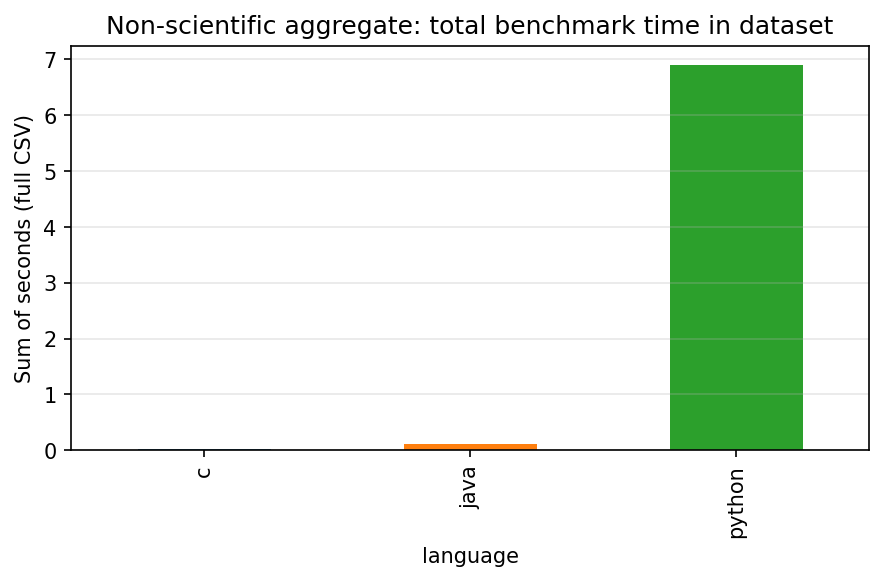

# Algorithmic Benchmarking Suite: C vs. Python vs. Java


## Project Overview
This repository contains the source code, datasets, and empirical analysis for a comparative study on algorithmic efficiency across different programming language architectures. The primary objective is to benchmark the performance of a compiled language (C), a bytecode/JIT-compiled language (Java), and an interpreted language (Python) when executing fundamental computer science algorithms.

This research was conducted as an Honors Project for CSE 1320 at the University of Texas at Arlington.

## 📊 Key Findings (Executive Summary)
Our empirical analysis reveals a clear performance hierarchy driven by language architecture:
- **C (Compiled):** Demonstrates near-zero overhead, outperforming Python by several orders of magnitude in computational-heavy sorting tasks.
- **Java (JIT/Bytecode):** Shows significant "warm-up" performance gains. While slightly slower than C, it maintains exceptional throughput for large datasets (N=5000), consistently beating Python.
- **Python (Interpreted):** Exhibits the highest overhead. Performance degrades sharply in worst-case scenarios (e.g., Quicksort on pre-sorted data), where execution time scales poorly compared to compiled alternatives.

### Performance Visualizations
| Total Execution Time | Cross-Language Speedup |
|:---:|:---:|
|  |  |

> [!TIP]
> **Full Research Report:** For a detailed deep dive into the methodology, experimental setup, and granular data analysis, please see our modular [IEEE Research Paper Index](docs/index.md).

## Algorithms Analyzed
The performance of each language is evaluated across both sorting and searching paradigms:
* **Sorting:** Quick Sort
* **Searching:** Linear Search, Binary Search

## Methodology
To ensure a rigorous and objective comparison, the benchmarking methodology relies on two distinct metrics across dynamically scaled datasets:

1. **Hardware-Dependent Metric (Execution Time):** Measuring CPU execution time to isolate the raw computational speed and language overhead.
2. **Hardware-Independent Metric (Iteration Count):** Tracking the absolute number of fundamental operations to ensure theoretical algorithmic complexity remains constant across all implementations.

Tests will be executed across varying input sizes (N) and data distributions (e.g., randomized, pre-sorted, and reverse-sorted arrays) to evaluate Best Case, Worst Case, and Average Case scenarios.

## Planned Repository Structure
\`\`\`text
├── /src
│   ├── /c          # C source files and executables
│   ├── /java       # Java source files and classes
│   └── /python     # Python scripts
├── /data           # Generated datasets (varying N sizes)
├── /results        # Output CSVs, benchmark logs, and plotted graphs
├── /docs           # Research paper drafts and supplementary materials
└── README.md
\`\`\`

## How to Run

### Python ([src/python/](src/python/))

From the repository root (or from `src/python`):

```text
python -m unittest discover -s src/python -v
```

Benchmark (prints one CSV row: `language,algorithm,distribution,N,comparisons,seconds`):

```text
python src/python/benchmark.py quicksort random 1000 --seed 42
```

### C ([src/c/](src/c/))

Requires a C11 compiler (GCC, Clang, or MSVC). On Windows, MinGW-w64 or MSYS2 is typical.

Using `make` (Git Bash, MSYS2, or WSL):

```text
cd src/c
make test
make
./benchmark quicksort random 1000 --seed 42
```

Manual GCC example:

```text
cd src/c
gcc -std=c11 -Wall -Wextra -O2 -o test_algorithms.exe test_algorithms.c algorithms.c
test_algorithms.exe
gcc -std=c11 -Wall -Wextra -O2 -o benchmark.exe benchmark.c algorithms.c
benchmark.exe linear_search ascending 5000
```

Wall-clock time uses `clock()`; comparison counts are returned via `algorithms_get_comparison_count()`.

### Java ([src/java/](src/java/) + [pom.xml](pom.xml))

Requires JDK 17+ and Apache Maven. From the repository root:

```text
mvn test
```

Run the benchmark CLI (classpath built by Maven):

```text
mvn -q exec:java -Dexec.args="quicksort descending 2000"
```

Wall-clock time uses `System.nanoTime()`; comparison counts come from `Algorithms.getComparisonCount()`.

### Benchmark data and graphs

1. Install plotting dependencies: `pip install -r requirements.txt`
2. Collect timings into [results/data/benchmark_runs.csv](results/data/benchmark_runs.csv):

   ```text
   python scripts/collect_benchmarks.py
   ```

   Options: `--languages python c java`, `--seed 42`, custom `--n 100 500 1000`. If the C `benchmark` executable is missing, C is skipped with a warning. For Java, `mvn` is resolved from `PATH` or a typical Scoop install under `%USERPROFILE%\scoop\apps\maven`; the JDK is taken from `JAVA_HOME` or Scoop’s `temurin*-jdk` / similar. If Maven or a JDK cannot be found, Java is skipped.

3. Generate figures under [results/graphs/](results/graphs/):

   ```text
   python scripts/plot_benchmarks.py
   ```

   Outputs include cross-language faceted plots (time and comparisons vs N), speedup vs C, grouped bar charts at selected N, heatmaps, per-language time and comparison curves, quicksort distribution effects, throughput proxies, a total-time summary bar, and a note on PRNG differences for **random** inputs (C, Python, and Java use different random sequences for the same seed).

---
*Author: Ali Alfridawi*