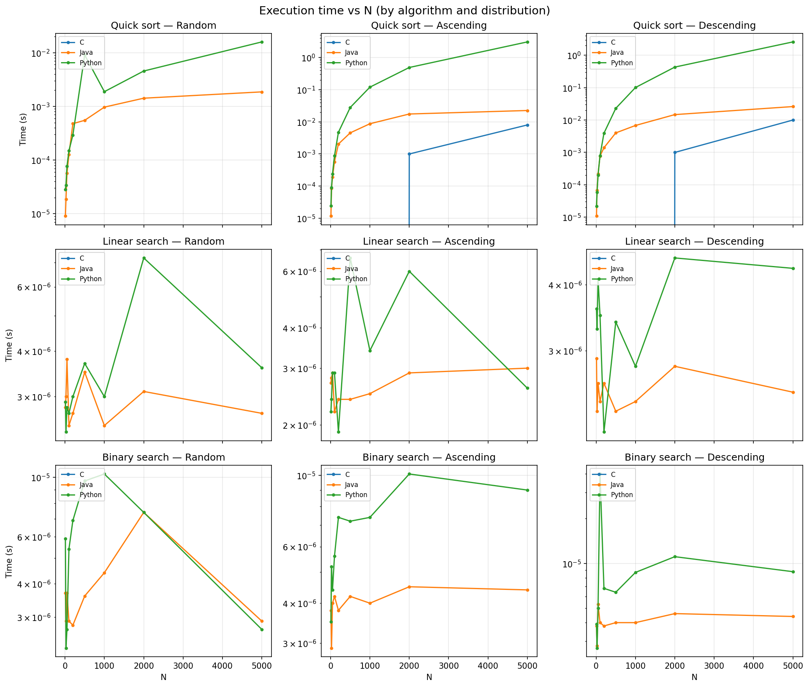
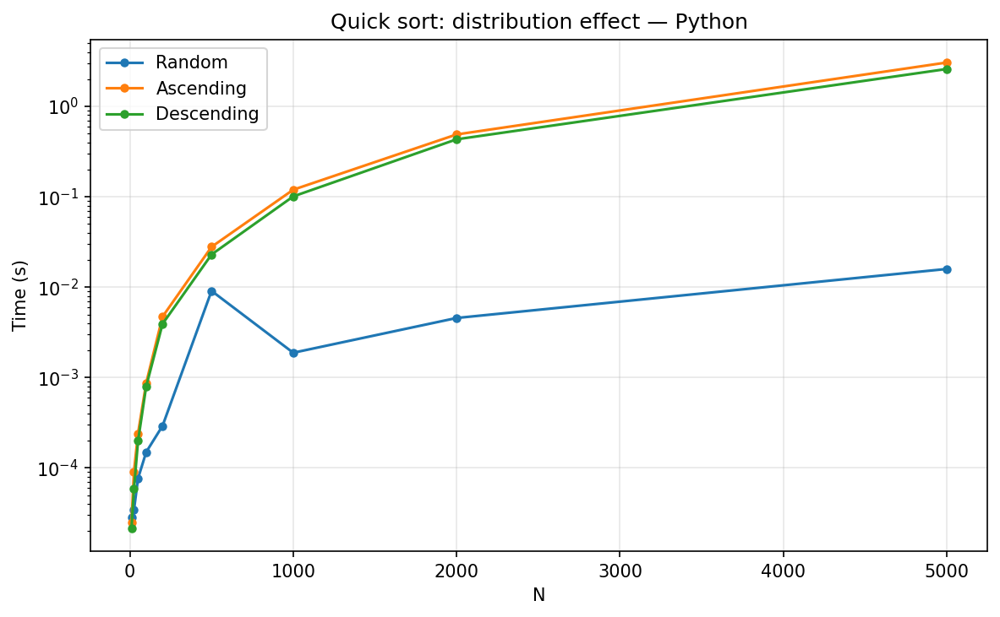
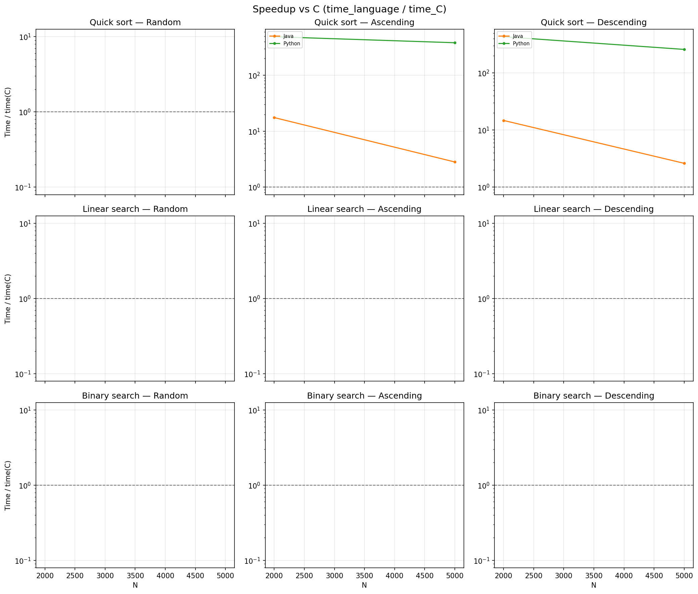

# V. Results and Analysis

### A. Execution Time Trends
The disparity in execution time is most evident in the Quick Sort algorithm as $N$ increases.

*Fig 1. Execution time across languages for varied distributions.*

### B. Sorting Distribution Effects
Python shows extreme sensitivity to pre-sorted data when using a standard Quick Sort implementation, while C and Java handle these distributions with significantly less relative penalty.

*Fig 2. Sensitivity of Python Quick Sort to input distribution.*

### C. Speedup vs. C
C serves as the baseline for maximum efficiency. The speedup graph highlights how Java approaches C's performance at scale, while Python remains consistently slower.

*Fig 3. Speedup of Java and Python relative to C.*
