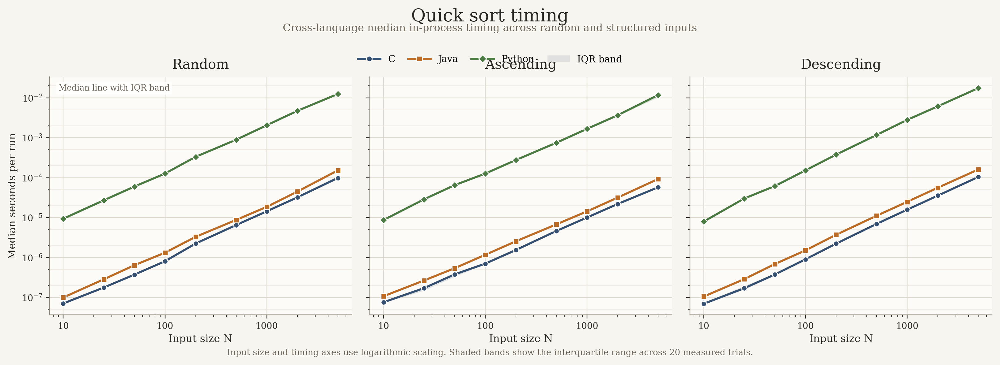
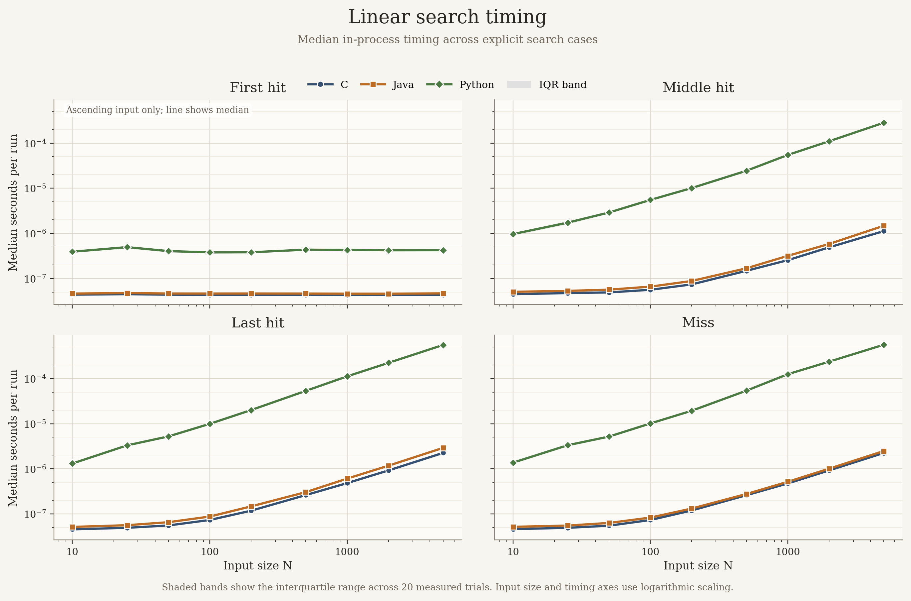
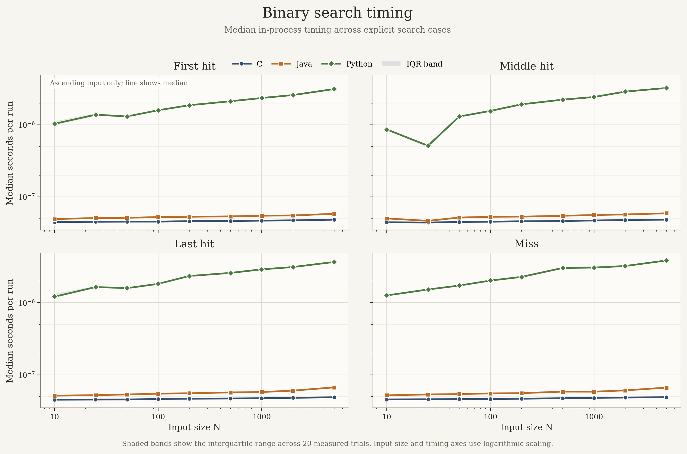
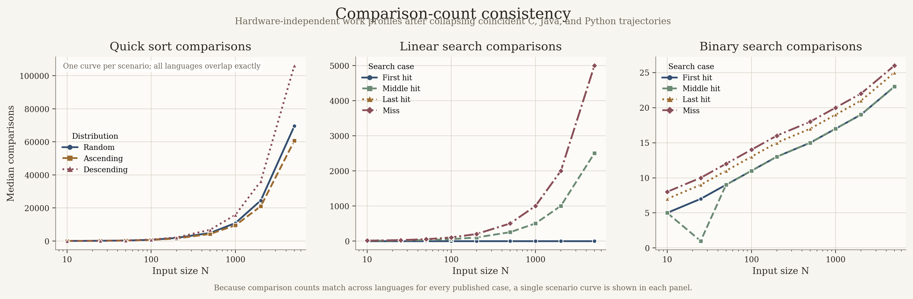
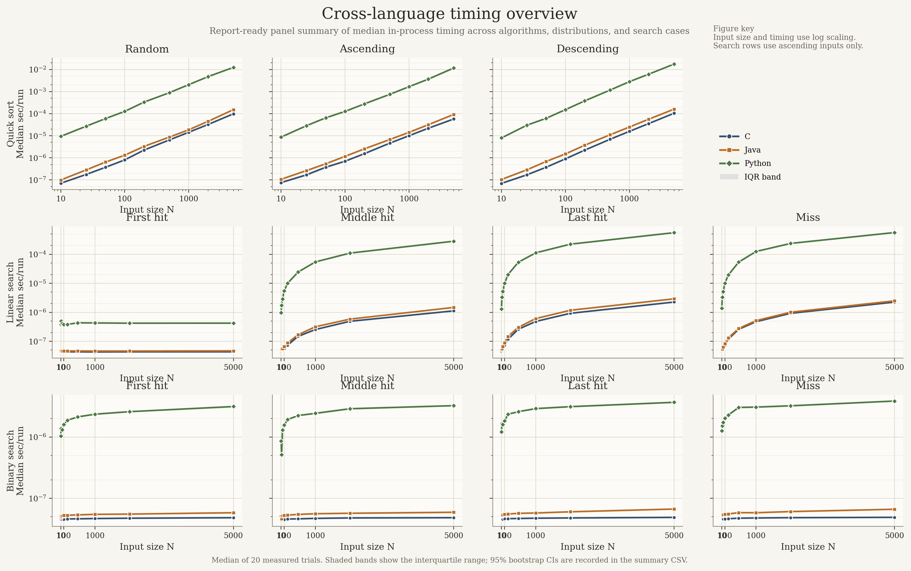
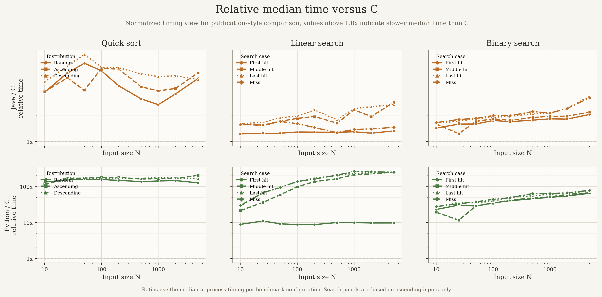

# V. Results and Analysis

All timing claims in this section are drawn from `results/data/benchmark_summary.csv`, which summarizes `20` measured trials per benchmark configuration after `5` warm-up trials. Figures in `results/graphs/` visualize the same summary table.

## A. Compact Result Table

The table below highlights three representative configurations from the checked-in summary artifact.

| Case | C median | Java median | Python median | Java / C | Python / C |
| --- | --- | --- | --- | --- | --- |
| Quicksort, `random`, `N=5000` | `0.0000983 s` | `0.0001523 s` | `0.0124753 s` | `1.55x` | `126.9x` |
| Linear search, `miss`, `N=5000` | `0.00000225 s` | `0.00000248 s` | `0.0005631 s` | `1.10x` | `250.5x` |
| Binary search, `miss`, `N=5000` | `0.0000000490 s` | `0.0000000663 s` | `0.00000386 s` | `1.35x` | `78.7x` |

Those rows are representative rather than exhaustive. The full benchmark matrix contains `297` language-case groups, and the summary CSV provides quartiles, IQR, and bootstrap confidence intervals for each group.

## B. Quicksort

Comparison counts match across languages for every quicksort configuration, so the published timing gaps represent observed in-process cost under a matched workload. At `N=5000` on random input:

- C median: `0.0000983 s`, IQR `0.0000954-0.0001085 s`, bootstrap CI `0.0000959-0.0001073 s`
- Java median: `0.0001523 s`, IQR `0.0001486-0.0001633 s`, bootstrap CI `0.0001495-0.0001610 s`
- Python median: `0.0124753 s`, IQR `0.0123559-0.0128730 s`, bootstrap CI `0.0123821-0.0128209 s`

These values correspond to about `1.55x` for Java versus C and `126.9x` for Python versus C on this host. Because startup and input loading are excluded, the correct interpretation is algorithm-section timing under this harness rather than full-program latency.

The current quicksort implementation uses a median-of-three pivot before the Lomuto partition step. That matters for ordered inputs and is one reason regenerated artifacts, not stale CSV snapshots, must drive the report.

## C. Linear Search

The linear-search benchmark separates explicit cases instead of reporting a single favorable hit configuration. The comparison counts behave exactly as expected:

- `first_hit` stays at `1` comparison
- `middle_hit` grows to `2501` comparisons at `N=5000`
- `last_hit` and `miss` both reach `5000` comparisons at `N=5000`

That case split is essential for interpretation. Without it, the benchmark could overrepresent best-case search behavior and understate the algorithm’s sensitivity to target position.

## D. Binary Search

Binary search remains logarithmic in comparison count. At `N=5000`, the published cases range from `23` to `26` comparisons depending on whether the lookup hits early, hits late, or misses.

The construct boundary is particularly important here: the timed region covers search over a prepared sorted array. It does not include the cost of sorting arbitrary input into that form. That design choice keeps the benchmark aligned to search-on-sorted-data rather than search-plus-preparation.

## E. Workload Consistency and Figure Use

The comparison-count figure collapses coincident C, Java, and Python trajectories because the summary CSV shows no cross-language comparison mismatches for any published configuration. That is the strongest internal validity signal in the repository: the experiment held the algorithmic work constant for every reported case.

The timing figures use medians with IQR bands. They are intended as interpretation aids, not replacements for the raw or summarized tables. Every headline claim in the abstract, introduction, and conclusion is traceable to one of three artifacts:

- `benchmark_runs.csv` for raw trial rows
- `benchmark_summary.csv` for numerical summaries and uncertainty fields
- `benchmark_metadata.json` for the host, toolchain, and artifact snapshot that contextualizes the measurements
